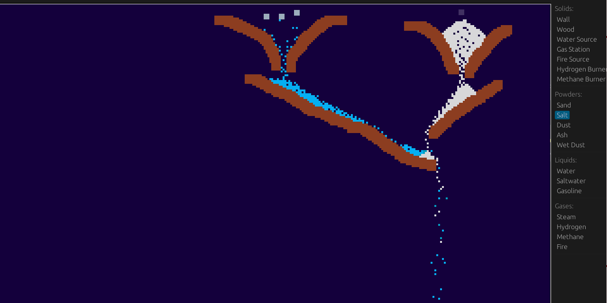

# Sandbox

## A simple 2D falling sand physics game

# Build the project

## Windows

1. Set up a Rust toolchain and clone the project. Change directory into the cloned project root.
2. Download SDL2.dll and SDL2.lib 2.32.8 and copy both files to the project root.
3. Type `cargo build --release`. The project will be built to the target/release folder.
4. Copy SDL2.dll to the build folder alongside the sandbox.exe.